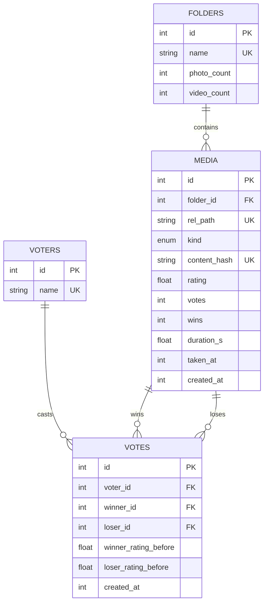

# Family Gallery — Data Schema

## Overview

Two data stores:

- **D1 (SQLite)** — four tables of metadata and game state:
  - **FOLDERS** — top-level directories from the external drive (device dumps, e.g. "Dad's Oppo Nov23")
  - **MEDIA** — one row per photo or video, carrying its Elo rating
  - **VOTERS** — the five family members (no passwords — identity is bound into the session cookie)
  - **VOTES** — append-only history of every head-to-head result
- **R2 (private bucket)** — derivative files only (resized photos, playable videos, poster frames). Originals never leave the external drive; nothing is ever publicly accessible.

There is no soft deletion and no user management — the dataset is append-mostly and administered manually by Pulkit (SQL / re-running ingest).

---

## Entity Relationship Diagram



---

## Tables

### FOLDERS

One row per top-level directory under `/Volumes/Elements/photos` (19 at last scan). Created on demand by ingest.

| Field | Type | Notes |
|-------|------|-------|
| id | INTEGER, PK, auto-increment | |
| name | TEXT, UNIQUE | Top-level drive folder name, verbatim (e.g. "Mom's Vivo Aug22") |
| photo_count | INTEGER, DEFAULT 0 | Denormalized; recomputed by ingest after each registration batch |
| video_count | INTEGER, DEFAULT 0 | Denormalized; recomputed by ingest after each registration batch |

### MEDIA

One row per photo or video. `rel_path` is the item's identity and mirrors the drive; `content_hash` is the ingest idempotency key.

| Field | Type | Notes |
|-------|------|-------|
| id | INTEGER, PK, auto-increment | Used in `/api/media/[id]` URLs |
| folder_id | INTEGER, FK → FOLDERS | Derived from the first path segment of `rel_path` |
| rel_path | TEXT, UNIQUE | Path relative to the drive's `photos/` root, original extension (e.g. `Dad's Oppo Nov23/IMG_0231.heic`). Its directory part is the subfolder path shown in the app's ⓘ Info panel |
| kind | TEXT CHECK IN ('photo','video') | Decides which R2 derivatives exist and which Elo pool the item competes in |
| content_hash | TEXT, UNIQUE | sha256 of the **original** file bytes. Re-running ingest can never duplicate a row, even if a file was moved/renamed on the drive |
| rating | REAL, DEFAULT 1500 | Elo rating. Ratings are only comparable within the same `kind` (see constraint 3) |
| votes | INTEGER, DEFAULT 0 | Total matchups this item appeared in |
| wins | INTEGER, DEFAULT 0 | Matchups won (`losses = votes − wins`) |
| duration_s | REAL, nullable | Videos only; from ffprobe |
| taken_at | INTEGER, nullable | Unix epoch from EXIF `DateTimeOriginal`, extracted before metadata stripping. NULL when EXIF absent. Enables future event-based regrouping |
| marked_at | INTEGER, nullable | Dustbin-flagged for deletion review; NULL = in play. Marked items are excluded from matchups (constraint 8) |
| kept_at | INTEGER, nullable | Trash review ruled "keep" — exempts the item from the 3-loss auto-suggestion forever |
| created_at | INTEGER, DEFAULT unixepoch() | Registration time |

Indexes: `(kind, rating)` for leaderboards, `(kind, votes)` for the vote floor, `(folder_id, kind)` for browsing.

### VOTERS

| Field | Type | Notes |
|-------|------|-------|
| id | INTEGER, PK, auto-increment | Bound into the session cookie by `POST /api/pick-name` |
| name | TEXT, UNIQUE | Seeded: Pulkit, Karishma, Medha, Mom, Dad. Additions via manual SQL |

### VOTES

Append-only, with one exception: single-step undo (constraint 2) deletes the voter's most recent row. Rows are never updated — the surviving history allows recomputing ratings from scratch (e.g. if the K-factor changes) and powers per-person stats.

| Field | Type | Notes |
|-------|------|-------|
| id | INTEGER, PK, auto-increment | |
| voter_id | INTEGER, FK → VOTERS | From the session cookie, never from the request body |
| winner_id | INTEGER, FK → MEDIA | |
| loser_id | INTEGER, FK → MEDIA | `CHECK (winner_id != loser_id)` |
| winner_rating_before | REAL | Rating snapshot at vote time — makes history auditable/replayable |
| loser_rating_before | REAL | |
| created_at | INTEGER, DEFAULT unixepoch() | |

---

## R2 Key Conventions

The bucket mirrors the drive's folder structure. All keys derive from `rel_path` with an extension swap; the four prefixes separate derivative types.

| Prefix | Contents | Used for | Derivation |
|--------|----------|----------|-----------|
| `thumb/{rel_path}.jpg` | Photo thumbnail, ~400 px longest edge, q70 | grids | extension → `.jpg` |
| `web/{rel_path}.jpg` | Photo display size, ~1600 px longest edge, q80 | lightbox, versus | extension → `.jpg` |
| `orig/{rel_path}.jpg` | Max-quality photo: JPEG sources copied at original resolution (lossless metadata-only strip); HEIC/PNG/BMP converted to full-resolution JPEG q95 for device compatibility | download | extension → `.jpg` |
| `video/{rel_path}.mp4` | Playable video — original bytes if already H.264/AAC MP4, else 1080p transcode | player, download | extension → `.mp4` |
| `poster/{rel_path}.jpg` | One extracted frame per video (grid thumbnail + player poster) | grids, player poster | extension → `.jpg` |

Example: `Dad's Oppo Nov23/VID_2023.mov` → `video/Dad's Oppo Nov23/VID_2023.mp4` + `poster/Dad's Oppo Nov23/VID_2023.jpg`.

Raw originals as-is are never uploaded — the `orig/` tier is the highest quality stored, and downloads serve it for photos (videos download their `video/` file, which is already the best available online). All tiers have EXIF/GPS metadata stripped (photo orientation is baked in before stripping); the strip is lossless for JPEG sources.

---

## Constraints

### 1. Elo update is atomic

`POST /api/vote` performs the K=24 update:

```
E_w  = 1 / (1 + 10^((R_l − R_w)/400))
R_w' = R_w + K·(1 − E_w)
R_l' = R_l − K·(1 − E_w)
```

Both MEDIA rating updates and the VOTES history insert execute in a single `db.batch([...])` — D1 batches are an implicit transaction, so a vote either fully applies or not at all. At family vote frequency no further concurrency control (locking, optimistic retries) is warranted; a lost-update between two simultaneous votes on the same photo would shift a rating by at most one K and is acceptable.

### 2. Vote undo is single-step and inverse

`POST /api/undo-vote` reverses only the calling voter's **most recent** vote (`ORDER BY id DESC LIMIT 1` for that voter_id). It recomputes the vote's rating delta from the stored `winner_rating_before` / `loser_rating_before` snapshots and applies the **inverse delta** — winner `rating −= Δ, votes −= 1, wins −= 1`; loser `rating += Δ, votes −= 1` — then deletes the VOTES row, all in one `db.batch`.

Inverse-delta rather than snapshot-restore is deliberate: restoring the "before" ratings verbatim would silently erase any votes other family members cast on the same items in the meantime; subtracting the delta cancels exactly this vote's contribution and nothing else. There is no undo stack — undoing twice in a row undoes the two most recent votes, one at a time, and an undo with no votes on record returns 404.

### 3. Matchups and votes never mix kinds

Enforced twice:
- `GET /api/matchup` selects a kind first, then two random items **of that kind**.
- `POST /api/vote` re-checks server-side that winner and loser share the same `kind` and rejects otherwise (defends against handcrafted requests corrupting the pools).

Consequently photo and video ratings are independent scales; the leaderboard is always per-kind.

### 4. Voter identity comes from the cookie

`votes.voter_id` is taken from the HMAC-signed HttpOnly session cookie. A request body voterId is ignored. Votes are rejected (403) when the cookie carries no voterId (name not yet picked).

### 5. Ingest idempotency

Three layers, any one of which prevents duplicates:
1. Local manifest (`path + mtime + size`) — fast skip without re-hashing 44k files
2. `media.content_hash` UNIQUE — the authoritative guard (`INSERT OR IGNORE`); survives file moves/renames on the drive
3. R2 HEAD-before-PUT — avoids re-uploading existing derivatives

`folders.photo_count` / `video_count` are recomputed (`UPDATE … SET x_count = (SELECT COUNT(*) …)`) after each registration batch rather than incremented, so they self-heal.

### 6. Leaderboard ranks by raw Elo

Leaderboard queries order by the stored rating directly:

```sql
WHERE votes >= :min_votes   -- default 1: exclude never-voted items
ORDER BY rating DESC
```

No shrinkage, no confidence weighting — early rankings are noisy and self-correct as matchups accumulate (deliberate choice; see workflow.md → Key Design Decisions). `min_votes` remains a query parameter for an optional "proven items only" view, defaulting to 1 so the board is meaningful from day one. Vote count and W–L record are returned with each row so the UI can display confidence context without influencing order.

### 7. Session validity

A request is authenticated iff its `fam` cookie's HMAC verifies against `SESSION_SECRET` **and** `exp` is in the future. Rotating `SESSION_SECRET` invalidates all sessions at once (the "log everyone out" lever). Changing `FAMILY_PASSWORD` affects only future logins — existing cookies live until expiry, so rotate both to fully revoke access.

### 8. Deletion is reviewed, permanent, and complete

Two paths feed the review queue (`GET /api/trash/list`, gated by the separate `TRASH_PASSWORD` → `famtrash` cookie): a manual dustbin mark (`marked_at`) and the automatic 3-loss suggestion (`votes − wins >= 3 AND kept_at IS NULL`). Marking immediately removes the item from matchups (`WHERE marked_at IS NULL` in both matchup queries) but deletes nothing.

Approving a delete removes everything the gallery holds for the item — all R2 derivatives (keys re-derived from `rel_path` + `kind`), all VOTES rows referencing it, and the MEDIA row — then recomputes the folder's counts. R2 objects are deleted before the D1 batch so a mid-flight failure leaves a retryable state, never orphaned bytes. Ratings other items earned against the deleted one are deliberately untouched. The drive's original file is not affected; re-running ingest would resurrect the item unless it is also removed from the drive.

### 9. D1/R2 scale envelope (context for constraints)

Full corpus ≈ 44.3k photos + 2.6k videos → ~47k MEDIA rows (well under D1's 5 GB / 100k-writes-per-day free limits; initial registration fits in one day). All tiers ≈ 125 GB in R2 (thumb+web ≈ 12 GB, orig ≈ 87 GB, video ≈ 26 GB) → ~$1.75/month past the free 10 GB. The media proxy relies on `Cache-Control: private, max-age=31536000, immutable` so each device fetches a given derivative once, keeping request volume far inside the Workers free tier (100k requests/day).
