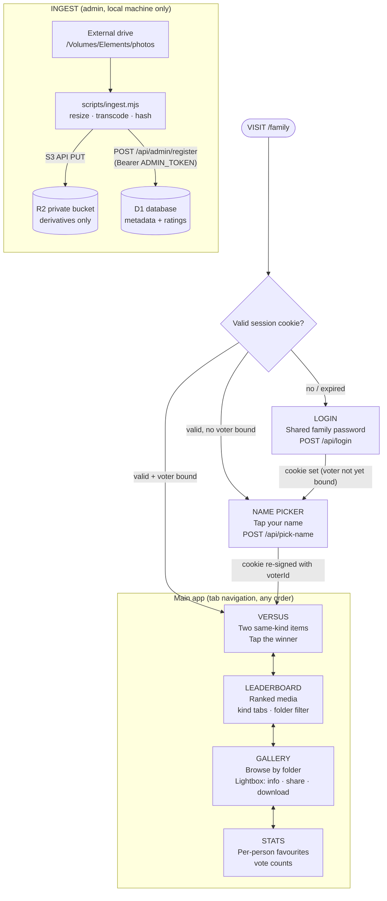

# Family Gallery — Application Workflow

A password-protected `/family` subpage where family members browse the photo/video archive and play an Elo-style head-to-head rating game, so the best media surfaces instead of rotting on an external drive.

## Flow Diagram

---

## Screen Descriptions

### LOGIN
Single password field, dark mono aesthetic matching the portfolio. `POST /api/login` compares the submitted password against the `FAMILY_PASSWORD` secret (constant-time compare) and on success sets an HMAC-signed, HttpOnly session cookie (~180 days) with no voter bound yet. There is no username. Wrong password shows an inline error; no lockout (family-trusted audience).

The `/family` HTML/JS shell itself is public and secret-free — the security boundary is the API layer, which returns 401 without a valid cookie (see Key Design Decisions).

### NAME PICKER
Shown when the session cookie is valid but carries no `voterId`. Displays the five family names as large tap targets (from `GET /api/voters`). Picking one calls `POST /api/pick-name`, which **re-signs the cookie with the voterId embedded** — from then on every vote is attributed server-side from the cookie, not from anything the client sends. Shown once per device/browser; a "not you?" link in the app footer returns here.

### VERSUS
The core game. Two media items of the **same kind** side by side (stacked on mobile), fetched from `GET /api/matchup?kinds=…`. Tap the one you like more → `POST /api/vote` → next pair animates in. A running "you've cast N votes" counter reinforces progress.

- **Format checkboxes** — Photos ☑ / Videos ☑ let each voter choose what they judge. Both checked (default): each round picks a kind at random (weighted by corpus size), then two random items of that kind. Matchups never mix kinds.
- **Videos** render as their poster frame with a play badge; tap-to-play inline (muted autoplay-on-tap, seekable) before voting.
- A **skip** button fetches a new pair without recording a vote (broken file, can't decide).
- An **undo** button (shown briefly after each vote, e.g. "Voted — Undo") reverses a misclick: `POST /api/undo-vote` cancels the voter's most recent vote and the previous pair returns so they can choose again. Single-step only — no undo history.
- An **expand button** (corner of each tile, distinct from the vote tap target) opens that item in the LIGHTBOX / PLAYER — info, share, and download available mid-game. Closing it returns to the same matchup, still undecided; expanding never counts as a vote.
- A **dustbin button** (below the expand button, two-tap: 🗑 → "SURE?") marks that item for deletion — `POST /api/mark-deletion`. Meant for junk that wound up in the collection (screenshots, misfires). Marked items leave the matchup pool immediately but are only *removed* after review in TRASH; the broken pair is replaced with a fresh matchup and undo is cleared.

### LEADERBOARD
Ranked grid from `GET /api/leaderboard?kind=&folder=&min_votes=`. Kind tabs (Photos / Videos — ratings are only comparable within a kind) and a folder filter. Items are ranked by **raw Elo rating** — no shrinkage, no vote floor beyond excluding never-voted items (`min_votes` default 1). Early rankings will be noisy (a lucky one-win item can sit high) and self-correct as votes accumulate — accepted by design. Tapping an item opens the LIGHTBOX / PLAYER (info, share, download) with rating, record (W–L), and vote count shown.

### GALLERY
Archive browsing, independent of the game. `GET /api/folders` lists the drive's top-level folders with counts; selecting one shows a paginated thumbnail grid (`GET /api/browse?folder=&cursor=`). Grid thumbnails for videos use their poster frame. Tapping any item opens the LIGHTBOX / PLAYER.

### LIGHTBOX / PLAYER
The shared full-screen viewer — opened from the gallery grid, the leaderboard, the versus tiles' expand button, and `#m={id}` deep links. Photos display the 1600 px `web/` derivative; videos play with seeking (HTTP Range) behind their poster frame. When opened from the leaderboard it additionally shows rating, W–L record, and vote count. Three actions:

- **ⓘ Info** — the item's metadata: original filename, date/time taken (from `taken_at`, EXIF capture time — "date unknown" when the source had no EXIF), the full subfolder path on the drive (derived from `rel_path`, e.g. `Digital Photoframe/2019/Goa trip`), and duration for videos. No extra API call — these fields are already in every media payload.
- **Share** — sends the item's deep link `https://pulkit-sinha.com/family/#m={id}` via WhatsApp (`wa.me/?text=…`), preferring the native share sheet (`navigator.share`) on mobile. The link opens the app directly on this viewer after the normal session check; recipients who aren't logged in hit the login wall first and land on the item afterwards (the `#m=` hash survives login). Because media stays cookie-gated, WhatsApp shows no image preview — the photo/video appears only for a signed-in family member.
- **Download** — saves the item to the device at **max quality**: `GET /api/media/[id]?size=orig&download=1` for photos (the `orig/` tier — full resolution, lossless copy for JPEG sources) and `?size=video&download=1` for videos (the best file stored online). The response carries `Content-Disposition: attachment` named after the original filename. Browsing never pays for this weight — viewing uses the light `web/` tier; only an explicit download fetches the big file. Available to any logged-in family member, no name pick required.

### TRASH (deletion review — restricted)
Moderation queue behind a **second password** (`TRASH_PASSWORD` Worker secret, distinct from the family password). Entering it at the in-app gate (`POST /api/trash/login`) grants a separate short-lived HttpOnly cookie (`famtrash`, 7 days) — a family session alone is never enough, and the trash cookie is worthless without a family session (both are checked).

`GET /api/trash/list` shows two kinds of candidates, most-marked/most-lost first:
- **MARKED** — dustbin-flagged by a family member (`media.marked_at`)
- **N LOSSES** — auto-suggested: anything with **3+ battle losses** not previously exonerated

Each card (thumbnail, filename, W–L record, reason badge) offers:
- **Keep** — exonerates: clears a manual mark, and for auto-suggestions sets `kept_at` so the item never reappears here (it keeps competing either way)
- **Delete** (two-tap confirm) — **permanent**: removes the R2 derivatives, the vote history rows, and the media row, then recomputes folder counts. The original file on the external drive is untouched — but re-running ingest would re-add the item (delete on the drive too if it's truly junk).

### STATS
Per-person flavour, from `GET /api/stats`:
- Vote counts per family member (who's played most)
- The current voter's most-picked winners (their personal top 12)
- Total corpus/vote counts

Deeper analytics (agreement between voters, most-contested items) are deferred — see Key Design Decisions.

### INGEST (not a screen — admin workflow on Pulkit's machine)
`scripts/ingest.mjs`, run locally against the external drive; never deployed, never in CI.

1. Walks a target folder (or the whole drive), preserving relative paths. Skips videos' sidecars (`.aae`), audio, and OS junk.
2. Resumable at three layers: a local manifest (`path+mtime+size`) for fast skips, a sha256 `content_hash` UNIQUE constraint in D1, and R2 HEAD-before-PUT.
3. Photos, three tiers: HEIC → JPEG via macOS `sips` first (sharp's prebuilt binaries lack HEIC); then sharp `.rotate()` (bakes EXIF orientation) → resize → JPEG for `thumb/` and `web/`. The `orig/` max-quality tier copies JPEG sources at full resolution with a lossless metadata-only strip (exiftool), and converts non-JPEG sources to full-resolution JPEG q95. `taken_at` is extracted before stripping.
4. Videos: `ffprobe` each file — already H.264/AAC MP4 → upload as-is; anything else (typically HEVC `.mov`) → `ffmpeg` transcode to 1080p H.264/AAC MP4. A poster frame JPEG is extracted for every video.
5. Uploads derivatives to R2 via the S3 API (R2 access-key pair), then registers metadata in batches of ~200 via `POST /api/admin/register` with the `ADMIN_TOKEN`.

CLI: `node scripts/ingest.mjs --dir "/Volumes/Elements/photos/Dad's Oppo Nov23"` (folder name becomes the gallery folder).

---

## API Summary

| Route | Method | Auth | Purpose |
|-------|--------|------|---------|
| `/api/login` | POST | password | Verify shared password → set signed HttpOnly cookie |
| `/api/session` | GET | cookie | Current session state (voterId, name) for the shell |
| `/api/voters` | GET | cookie | Family name list for the picker |
| `/api/pick-name` | POST | cookie | Re-sign cookie with chosen voterId |
| `/api/matchup` | GET | cookie | Two random same-kind items (`?kinds=photo,video`) |
| `/api/vote` | POST | cookie + voter | Elo update; voterId read from cookie only |
| `/api/undo-vote` | POST | cookie + voter | Reverse the caller's most recent vote (single-step, inverse delta) |
| `/api/leaderboard` | GET | cookie | Ranked media (`?kind=&folder=&min_votes=`) |
| `/api/folders` | GET | cookie | Folder list with counts |
| `/api/browse` | GET | cookie | Paginated media in a folder (`?folder=&cursor=`) |
| `/api/stats` | GET | cookie | Per-person stats |
| `/api/media/[id]` | GET | cookie | R2 media proxy (`?size=thumb\|web\|orig\|poster\|video`), HTTP Range for video; `&download=1` adds `Content-Disposition: attachment` (save-to-device, max-quality tier); `?meta=1` returns the item's JSON metadata (used by deep links) |
| `/api/admin/register` | POST | Bearer `ADMIN_TOKEN` | Batch insert media/folders from ingest |
| `/api/mark-deletion` | POST | cookie | Dustbin: flag a media item for deletion review |
| `/api/trash/login` | POST | cookie + `TRASH_PASSWORD` | Verify review password → set `famtrash` cookie (7 days) |
| `/api/trash/list` | GET | cookie + trash cookie | Review queue: marked items + 3-loss auto-suggestions |
| `/api/trash/action` | POST | cookie + trash cookie | Rule on an item: `delete` (permanent) \| `keep` \| `unmark` |

All cookie-gated routes return `401` without a valid session; the frontend treats any `401` as "show the login view". Trash routes return `403` when only the trash cookie is missing, which the frontend renders as the review-password gate.

---

## Permissions Summary

| Action | Visitor (no cookie) | Family (cookie) | Family (cookie + name) | Ingest script (ADMIN_TOKEN) |
|--------|--------------------|-----------------|------------------------|------------------------------|
| Load `/family` HTML shell | ✓ | ✓ | ✓ | — |
| See any photo/video bytes | ✗ | ✓ | ✓ | — |
| Browse gallery / leaderboard / stats | ✗ | ✓ | ✓ | — |
| Download photos/videos to device | ✗ | ✓ | ✓ | — |
| Open a shared `#m={id}` deep link | login wall first | ✓ | ✓ | — |
| Get matchups | ✗ | ✓ | ✓ | — |
| Cast votes | ✗ | ✗ | ✓ | — |
| Undo own most recent vote | ✗ | ✗ | ✓ | — |
| Mark an item for deletion (dustbin) | ✗ | ✓ | ✓ | — |
| Review / permanently delete marked items | ✗ | `TRASH_PASSWORD` gate | `TRASH_PASSWORD` gate | — |
| Register new media | ✗ | ✗ | ✗ | ✓ |
| Add/remove voters, reset ratings | ✗ | ✗ | ✗ | manual SQL only |

---

## Key Design Decisions

### The security boundary is the API, not the HTML
The repo is public on GitHub, so the `/family` shell (HTML/CSS/JS) is treated as public content containing zero secrets. What is protected is **media bytes and data**, enforced by the session check inside every `/api/*` handler — including the media proxy. The password exists only as a Cloudflare Worker secret; family photos exist only on the external drive and in the private R2 bucket. Nothing sensitive can leak via GitHub by construction.

### Session cookie format
`fam = base64url(payload) . base64url(HMAC-SHA256(payload, SESSION_SECRET))` with payload `{v, voterId|null, iat, exp}`. `HttpOnly; Secure; SameSite=Lax; Max-Age ≈ 180d`. Web Crypto only — no JWT library. `crypto.subtle.verify` gives constant-time signature checks.

### Voter identity is server-derived
`POST /api/vote` reads the voterId **only** from the signed cookie — never from the request body. Client JS cannot read or forge the HttpOnly cookie, so per-person stats can't be spoofed. localStorage holds the display name only.

### Matchups are random and never mix kinds
Pairing is uniformly random within a kind (Pulkit's preference — no rating-similarity or under-voted bias). Photo-vs-video comparisons are apples-and-oranges, so each round is photo-vs-photo or video-vs-video; the two Elo pools are independent and the leaderboard is per-kind.

### Raw Elo ranking, self-correcting over time
The leaderboard orders by raw Elo rating. Early on this is noisy — an item with one lucky win sits above a proven 8–2 record — but every additional matchup corrects it, and the system converges naturally as the family plays. This was chosen over confidence-shrinkage or vote floors deliberately: the ranking always reflects exactly what the Elo math says, with no interpretive layer. Only never-voted items (still at the untouched 1500 default) are excluded, so the board only ever shows items someone has actually judged. The vote count and W–L record are displayed alongside the rating so viewers can eyeball confidence themselves.

### Videos are transcoded only when needed
`ffprobe` decides: browser-compatible files upload as-is; HEVC/quirky containers transcode to 1080p H.264/AAC MP4. Storage cost is trivial either way (25.8 GB ≈ $0.40/month; R2 egress is free) — the constraint is browser playback, not money.

### Ingest is resumable by construction
Three independent idempotency layers (manifest, content-hash UNIQUE, R2 HEAD) mean the script can be interrupted and re-run at any point without duplicates — necessary for a 44k-file initial run and for incremental additions later.

### Shareable deep links carry no access
`/family/#m={id}` identifies an item but grants nothing — media bytes always come through the cookie-checked proxy. A link forwarded outside the family dead-ends at the login wall. The trade-off is deliberate: no WhatsApp link previews (the preview crawler isn't authenticated), in exchange for links that are safe to share freely. The hash fragment also never reaches the server or its logs.

### No framework, no build step
Matches the rest of the site: plain HTML/CSS/JS shell reusing `css/variables.css` tokens. The backend is a Worker — `worker.js` routes `/api/*` to plain-JS handler modules in `functions/`, bundled by wrangler at deploy; everything else serves from static assets. Local development uses `npx wrangler dev` (the only workflow change — `python3 -m http.server` cannot run the Worker).

### Deferred (post-v1)
Voter-agreement / most-contested analytics · audio recordings ("Mom's Voice Recordings") · family upload UI · admin album management UI · event-based regrouping of device-dump folders using `taken_at`.

---

## One-Time Setup Checklist

The site deploys as the Worker `portfolio-website` (`npx wrangler deploy`); bindings live in the committed `wrangler.toml` — no dashboard binding config needed.

1. `npx wrangler d1 create family-gallery` → apply `schema.sql` remotely (seeds the five voters) ✅ done 2026-07-25
2. Enable R2 on the account (dashboard → R2 → activate), then `npx wrangler r2 bucket create family-gallery` (private — no public access)
3. R2 API token (dashboard → R2 → Manage API Tokens) → `scripts/.env` for the ingest script
4. `npx wrangler secret put` × 4: `FAMILY_PASSWORD`, `SESSION_SECRET`, `ADMIN_TOKEN` ✅ done 2026-07-25; `TRASH_PASSWORD` (trash-review gate). Confirm with `npx wrangler secret list` — if it is absent, `/api/trash/login` rejects every password with the same 403 it gives a wrong one
5. Local dev: copy `.dev.vars.example` → `.dev.vars`, apply schema `--local`, run `npx wrangler dev` (localhost:8787)
6. Deploy: `npx wrangler deploy` (uploads static assets minus `.assetsignore` + the Worker)

## Costs

- Photo tiers ≈ 99 GB (thumb+web 12 GB, orig ≈ 87 GB), videos ≈ 26 GB → ~$1.75/month R2 once past the 10 GB free tier; egress free (downloads and streaming cost nothing)
- All request/DB volumes are orders of magnitude inside Cloudflare free tiers at family scale
